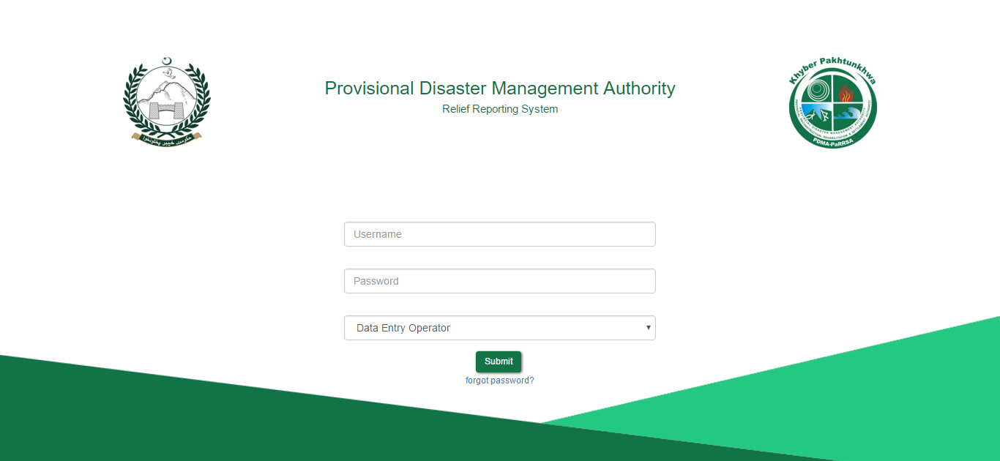
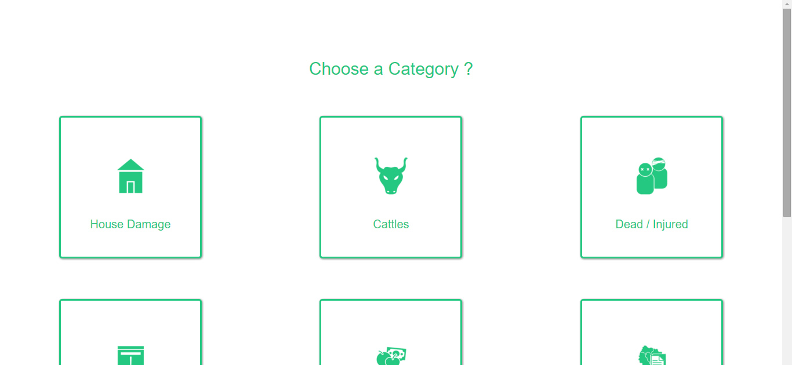
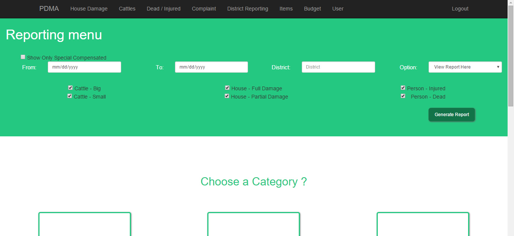
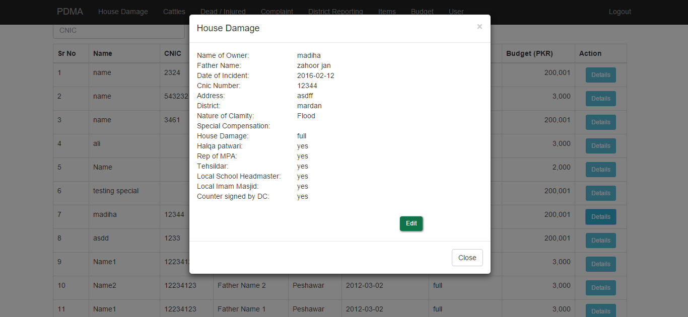

#PDMA (Relief-Section) Reporting System
###INTRODUCTION
PDMA is currently keeping their data in unstructured form i.e. Word files. The
staff uses manual methods to maintain their records. Generating reports from 
this unstructured data is a hectic process, which may take more than a day for 
just a single report.

The proposed system is a web app with structured and normalized database. New 
data entry will be done efficiently along with instant report generation with new 
solution.

###GETTING STARTED
<ul>
<li>Copy the root folder to htdocs or www folder depending on your server</li>
<li>Import database file "pdmareporting.sql"</li>
<li>Set the database settings in db.php file</li>
<li>You are now ready to start http://localhost/PDMAreporting</li>
</ul>

###SOME SNAPSHOTS

### Temporary URL
http://pdma.engrzeeshan.com/
